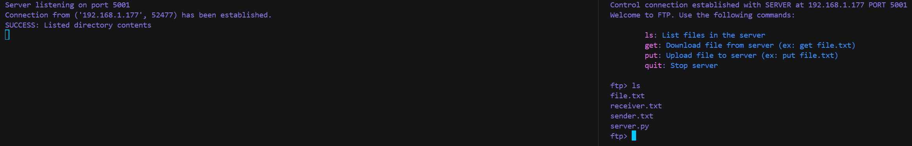
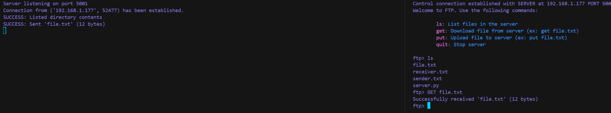
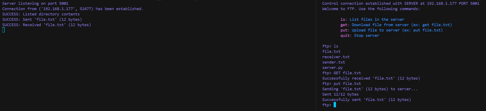

    <h1>FTP Server Client</h1>
    
    
    
    

## Table of Contents

1. [Overview](#-overview)
2. [Features and Demo](#features-and-demo)
3. [License](#-license)

## 🌟 Overview

**FTP Server Client** is a Python-based application designed for efficient file transfer between a client and a server over a TCP/IP network. It uses a custom FTP-like protocol with separate control and data channels to manage file uploads, downloads, listing, and session management.

## **Features and Demo**

### Feature 1: File Listing

- **Description**: Users can request a list of files from the server directory using the `ls` command, which sends the list directly over the control channel.

  - **Screenshot**:

    

### Feature 2: File Download

- **Description**: The `GET <filename>` command allows users to download files from the server. The server provides the data port and file size, setting up a data channel for the transfer.

  - **Screenshot**:

    

### Feature 3: File Upload

- **Description**: Users can upload files to the server using the `PUT <filename>` command. The server prepares a data channel for receiving the file, ensuring efficient data handling.

  - **Screenshot**:

    

## 📄 License

This project is licensed under the MIT License - see [LICENSE.md](LICENSE.md) for details.
